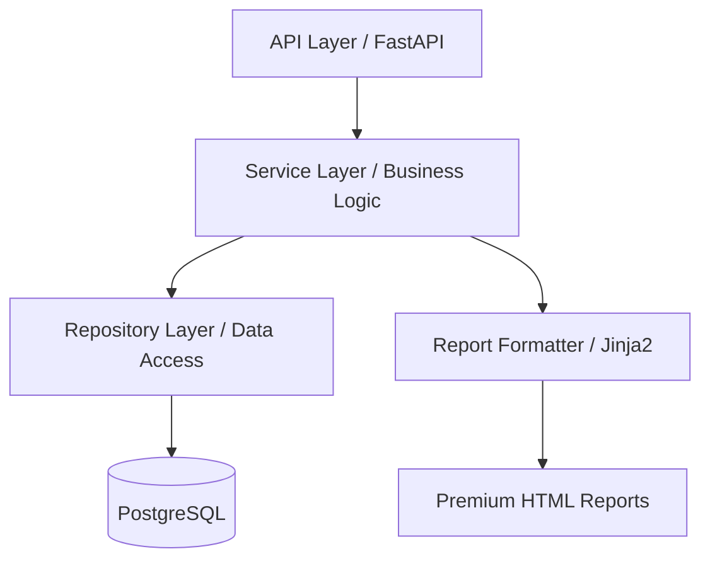

# Analytical Intelligence Briefing Service

A production-grade FastAPI service designed to generate high-impact, professional briefing reports for financial and strategic analysis.

## 🚀 Overview

The **Intelligence Briefing Generator** transforms raw data into structured, visually premium analytical reports. It features a robust domain model, atomic persistence layer, and a high-fidelity rendering engine inspired by top-tier investment bank research.

### Core Features
- **Professional Domain Model**: Structured entities for Briefings, Highlights, Threats, and Metrics.
- **Atomic Migrations**: Reliable PostgreSQL schema management with a custom runner.
- **Structured Validation**: Comprehensive Pydantic-based rules with human-readable error reporting.
- **Premium Aesthetics**: High-quality HTML reports using refined Jinja2 templates and modern typography.
- **Global Error Handling**: Consistent, structured JSON error responses across all API endpoints.

---

## 🏗️ Architecture

The service follows a clean, decoupled architecture to ensure maintainability and testability:



- **API Layer**: Handles HTTP orchestration and input validation.
- **Service Layer**: Manages business rules, report compilation, and error translation.
- **Repository Layer**: Encapsulates all SQLAlchemy and ORM logic.
- **Infrastructure**: Custom migration runner and robust session management.

---

## 🛠️ Setup & Installation

### Prerequisites
- Python 3.12+
- Docker & Docker Compose (for PostgreSQL)

### Local Development
1. **Clone the repository and enter the service directory**:
   ```bash
   cd python-service
   ```

2. **Initialize the virtual environment**:
   ```bash
   python -m venv .venv
   source .venv/bin/activate
   pip install -r requirements.txt
   ```

3. **Start the database**:
   ```bash
   docker-compose up -d
   ```

4. **Run database migrations**:
   ```bash
   python -m app.db.run_migrations
   ```

5. **Start the application**:
   ```bash
   uvicorn app.main:app --reload
   ```

---

## 🧪 Quality Assurance

We maintain high standards through automated testing and strict schema validation.

### Running Tests
```bash
# Execute the full test suite
pytest tests/
```

### Validation Rules
- **Entity Names**: Required, non-empty, maximum 120 characters.
- **Key Points & Risks**: Minimum of 2 entries required for strategic depth.
- **Financial Metrics**: Must have unique, non-overlapping labels.

---

## 📖 API Usage

| Endpoint | Method | Description |
| :--- | :--- | :--- |
| `/health` | `GET` | Service status and versioning. |
| `/briefings` | `POST` | Register a new briefing record. |
| `/briefings/{id}` | `GET` | Retrieve structured briefing data. |
| `/briefings/{id}/generate` | `POST` | Compile data into a report model. |
| `/briefings/{id}/html` | `GET` | Fetch the rendered HTML report. |

---

## 📝 License
Proprietary and Confidential. Built for the Alpha Backend Assessment.
