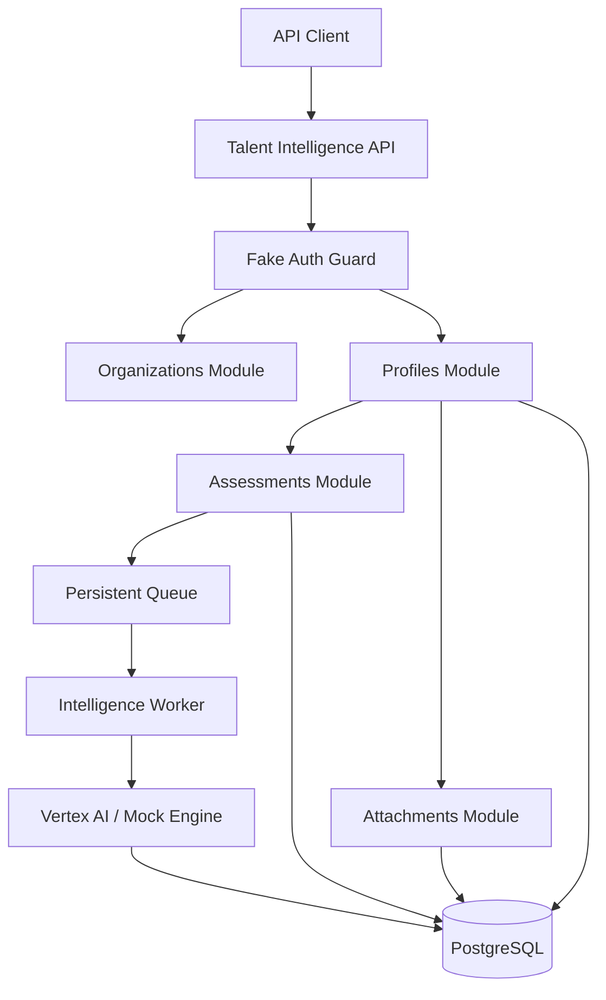

# Talent Intelligence Service (TIS)

The **Talent Intelligence Service (TIS)** is a production-grade NestJS backend designed to orchestrate the lifecycle of professional talent evaluation through advanced intelligence engines. It provides a secure, multi-tenant environment for registering talent profiles, managing strategic attachments, and generating high-fidelity intelligence assessments.

## Core Capabilities

-   **Multi-Tenant Isolation**: Built from the ground up with organizational boundaries, ensuring strict data segregation across all entities.
-   **Intelligence Orchestration**: Asynchronous evaluation pipeline that leverages Vertex AI (Gemini) or simulated intelligence engines.
-   **Secure Attachments**: Professional management of talent-related documents and extracted content blobs.
-   **Standardized Error Handling**: A global `ApiExceptionFilter` ensures consistent, human-readable, and professional error reporting.
-   **Validated Data Contracts**: Hardened DTOs using `class-validator` for guaranteed data integrity.
-   **Resilient Background Processing**: Persistent queue-driven worker architecture for high-performance assessment generation.

---

## Technical Architecture

The service follows a modular, repository-pattern architecture designed for scalability and maintainability.



---

## Getting Started

### Prerequisites

-   **Node.js**: Version 22 or higher.
-   **NPM**: Version 10 or higher.
-   **Database**: PostgreSQL 15+ (can be started via the root `docker-compose.yml`).

### Installation

1.  **Install Dependencies**:
    ```bash
    npm install
    ```

2.  **Configure Environment**:
    ```bash
    cp .env.example .env
    ```
    *Ensure `DATABASE_URL` is correctly configured.*

3.  **Run Migrations**:
    ```bash
    npm run migration:run
    ```

4.  **Start the Service**:
    ```bash
    npm run start:dev
    ```

---

## API Interaction

### Security Headers

All requests must include professional identity headers for multi-tenant isolation:

-   `x-user-id`: Unique identifier for the authenticated user (e.g., `admin-01`).
-   `x-workspace-id`: The corporate organization identifier (e.g., `org-acme-corp`).

### Primary Endpoints

| Resource | Method | Path | Description |
| :--- | :--- | :--- | :--- |
| **Profiles** | `POST` | `/profiles` | Register a new professional talent profile. |
| **Profiles** | `GET` | `/profiles` | List all talent profiles in the organization. |
| **Attachments** | `POST` | `/profiles/:id/attachments` | Link a document/blob to a talent profile. |
| **Assessments** | `POST` | `/profiles/:id/assessments/trigger` | Initiate an asynchronous intelligence evaluation. |
| **Assessments** | `GET` | `/profiles/:id/assessments` | List all assessments for a specific profile. |

---

## Reliability & Testing

The system maintains a comprehensive test suite to ensure architectural integrity.

```bash
# Run Unit Tests
npm test

# Run End-to-End Tests
npm run test:e2e
```

---

## License

Copyright © 2026 TalentFlow Intelligence. All rights reserved.
